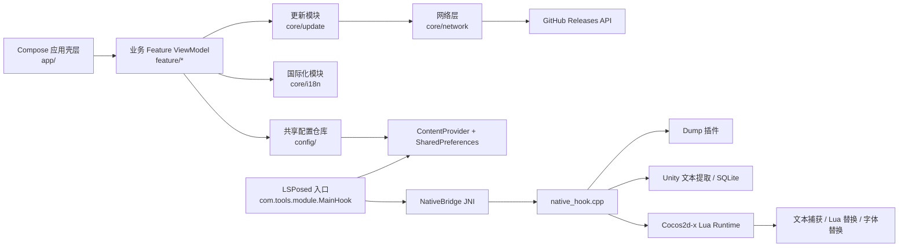
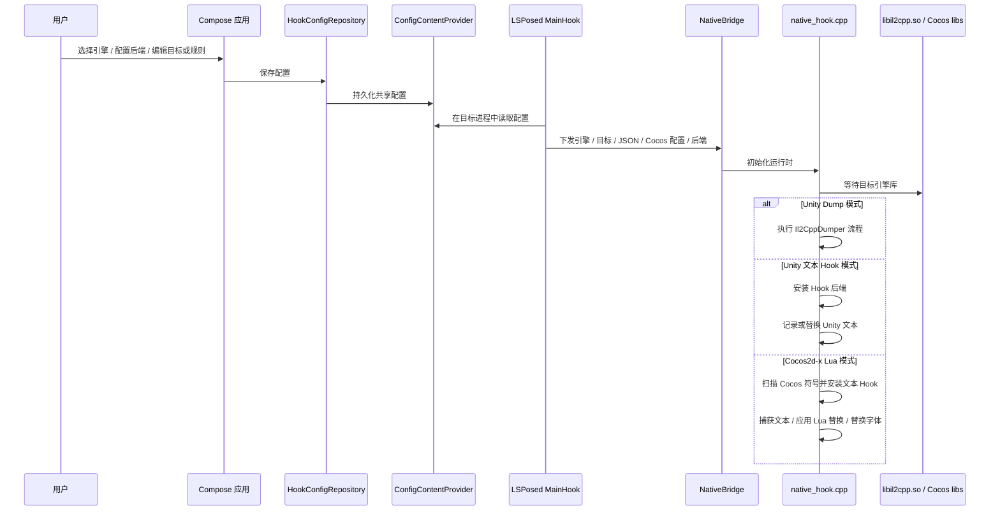

il2Fusion
================

  

il2Fusion 是一个运行在 Android 侧、围绕 LSPosed、JNI 与 Native Hook 后端构建的 Unity / Cocos2d-x Lua 游戏逆向工程工具集。它将 Il2Cpp dump 生成、可配置文本拦截、Cocos 运行时文本捕获、Lua 替换规则、跨进程配置同步以及设备端逆向辅助能力整合到同一套工作流中。

英文版：见 [README_EN](doc/README_EN.md)。

## 核心亮点
- 双 Native Hook 后端，可在运行期切换：默认使用 `And64InlineHook`，并提供 `Dobby` 作为替代方案。
- Dump 优先工作流，可生成 `dump.cs` 并导出到 `/sdcard/Download/<pkg>.cs`。
- Unity 文本拦截链路，优先使用 JSON/RVA 目标，缺失时回退到反射方式。
- Cocos2d-x Lua 运行时支持，可捕获 Label、Text、RichText、Button、TextField 等常见文本入口。
- Lua 替换规则支持导入、编辑、启用/禁用和删除，可在脚本加载时 patch 指定 chunk。
- 内置多语言 Noto Sans 字体，可为 Cocos 文本替换场景安装目标进程可访问的字体文件。
- Settings 页面支持检测已注入目标进程、查看 text.db 状态，并请求目标进程导出 `text.db`。
- 从应用进程到 LSPosed 注入进程的跨进程配置同步能力。

## 架构总览

## 工作原理

## 功能集合
- **Dump 工作流：** 触发 Il2Cpp dump 生成，并将结果导出到设备下载目录。
- **文本拦截：** 对 Unity 文本 setter 安装 Native Hook，并将捕获结果写入 SQLite。
- **解析流程：** 从 `dump.cs` 中提取 `set_text` 目标，并以方法名和 JSON 元数据形式持久化。
- **Cocos2d-x Lua 工作流：** 扫描 Cocos 文本符号，捕获 native / Lua binding 文本，支持测试替换、延迟模拟、突发延迟保护和 text.db 持久化。
- **Lua 规则配置：** 从配置文件导入 Lua 替换规则，也可在应用内新增、编辑、启用/禁用和删除规则。
- **字体替换：** 提供多语言 Noto Sans 字体资源，支持为 Cocos 文本替换安装目标进程可访问的字体。
- **目标检测与导出：** 显示已注入目标进程的在线状态，并支持从目标进程导出 `text.db` 后分享。

## 环境要求
- 已 Root 的设备，并具备 Magisk + LSPosed 环境。
- Android 9+（`minSdk 28`、`targetSdk 35`、`compileSdk 36`）。
- 默认 ABI：`arm64-v8a`。
  如需支持更多 ABI，请补充 `app/src/main/cpp/libs/<abi>/libdobby.a` 并更新 `ndk.abiFilters`。
- 已验证设备：Google Pixel 3 XL，Android 12（`SP1A.210812.016.C2 / 8618562`）。

## 快速开始
1. 构建模块：`./gradlew :app:assembleDebug`
2. 安装 APK，并在 LSPosed 中只勾选一个目标应用。
3. 打开 il2Fusion 应用，在“运行”页选择目标引擎。
   Unity 文本 Hook 模式：
   保持 Dump 关闭，解析 `dump.cs`，并保存目标 setter 列表。
   Unity Dump 模式：
   开启 Dump，启动目标应用，并等待 `dump.cs` 导出。
   Cocos2d-x Lua 模式：
   选择 Cocos2d-x Lua，按需开启运行时文本捕获、text.db 写入、Lua 替换规则和字体替换。
4. 在目标应用中验证运行结果。
   Unity 文本 Hook 模式：
   等待 `libil2cpp.so`，确认 Hook 安装完成，并检查 `/data/data/<pkg>/text.db`。
   Unity Dump 模式：
   等待 Dump 流程完成，并检查 Download 目录中的输出文件。
   Cocos2d-x Lua 模式：
   等待 Cocos 引擎库加载，确认 Cocos 日志中出现文本捕获或 Lua 替换记录，并检查目标应用目录下的 `text.db`。

## 项目结构
- `app/src/main/java/com/tools/il2fusion/app/`：应用壳层、导航、启动更新检查和全局弹窗。
- `app/src/main/java/com/tools/il2fusion/feature/`：基于 MVVM 的页面级业务 Feature，包括 overview、mode、parse、settings。
- `app/src/main/java/com/tools/il2fusion/core/`：共享模块，包括设计组件、国际化、网络层和更新流程。
- `app/src/main/java/com/tools/il2fusion/config/`：供应用进程与 Hook 进程共同使用的 Provider 配置层。
- `app/src/main/java/com/tools/module/`：LSPosed 入口、目标检测、text.db 导出、Cocos 字体安装与 JNI 对接的 Android 桥接层。
- `app/src/main/cpp/`：Native Hook 运行时、Il2CppDumper 集成、Unity 文本提取、Cocos runtime 插件和 SQLite 支持。
- `app/src/main/assets/xposed/`：LSPosed 模块描述与入口声明。

## 致谢
- [Rprop - And64InlineHook](https://github.com/Rprop/And64InlineHook)：ARM64 Inline Hook 实现。
- [jmpews - Dobby](https://github.com/jmpews/Dobby)：轻量级跨平台 Hook 框架。
- [Perfare - Zygisk-Il2CppDumper](https://github.com/Perfare/Zygisk-Il2CppDumper)：Il2CppDumper 实现参考。

## 贡献
- 欢迎提交 issue 与功能建议。建议附上目标应用、Android 版本、LSPosed 环境、期望行为和日志。
- 欢迎提交改进 Hook 稳定性、解析准确度、ABI 覆盖、文档质量或 UI/UX 的 PR。

## 免责声明
- 本项目仅供学习、研究与安全测试之用，不得用于任何违法、侵权或商业牟利场景。
- 使用者需自行确保遵守所在地法律法规，并对由此产生的全部后果自行承担。
